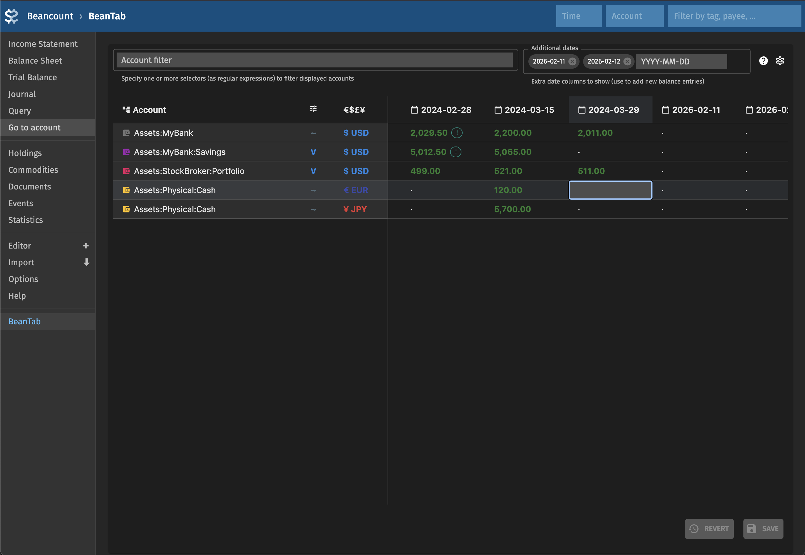

# BeanTab


BeanTab is a spreadsheet-like interface for [Fava](https://fava.pythonanywhere.com/) to mangage balance assertions in your [Beancount](https://beancount.github.io/) ledger.



What's the ideal way to manage balance assertions? I switched to Beancount from spreadsheets where I used to track balances of accounts and, as a consequence, total net worth. I got many more possibilities and features as a reward of that migration but if I'm being honest, some aspects of tracking just balances were more convenient in spreadsheets.

Why not to get the best of both worlds?
BeanTab is meant to be a part of Beancount plugin ecosystem that makes that particular workflow pleasant to use. It relies on ```balance-ext``` and ```pad-ext``` from [beancount-lazy-plugins](https://github.com/Evernight/beancount-lazy-plugins) extensions that augment the original ```balance``` and ```pad``` operations with more functionality and flexibility.

## Features

- **Spreadsheet-style balance table** — View all balance assertions, valuations, and `balance-ext` entries in an editable grid (powered by [RevoGrid](https://github.com/revolist/revogrid))
- **Inline editing** — Add or modify balance entries directly in the table; changes are written to your Beancount files on save
- **Multiple balance types** — Supports regular Balance, valuation, and `balance-ext` directives (regular, padded, full-padded, valuation)
- **Filtering** — Can be filtered by account / regex and a couple of additional settings to only show the set of accounts you're interested in
- **URL-persisted settings** — Current configuration (filters, sort, layout) is stored in the URL for bookmarking / saving using ```fava-sidebar-link``` directive

## Installation

```bash
pip install git+https://github.com/Evernight/beantab.git
```

### Add to your Beancount ledger

Add the Fava extension directive:

```beancount
2024-01-01 custom "fava-extension" "beantab" "{}"
```

For suggested usage pattern you will need to set up [balance-ext](https://github.com/Evernight/beancount-lazy-plugins/blob/main/docs/balance_extended/README.md) and [pad-ext](https://github.com/Evernight/beancount-lazy-plugins/blob/main/docs/pad_extended/README.md) from [beancount-lazy-plugins](https://github.com/Evernight/beancount-lazy-plugins). See [example](example/example.beancount) for more details.

## Usage

1. Run Fava with your ledger:

```bash
fava your-ledger.beancount
```

2. Open the **BeanTab** tab in the Fava sidebar.

3. Use the table to:
   - View balances across accounts and dates
   - Edit cells to add or change balance assertions (append `~` for padded, `!` for regular when overriding)
   - Use Settings to adjust grouping, filtering, and visibility
   - Save changes to write `balance-ext` entries to your ledger / included files

## Development

```bash
make deps          # Install Python (uv) and frontend (npm) dependencies
make build         # Build the frontend bundle
make dev           # Run Fava with example ledger + esbuild watch
```

With a custom ledger path:

```bash
make dev LEDGER_FILE=path/to/your/ledger.beancount
```

## See Also
- [lazy-beancount](https://github.com/Evernight/lazy-beancount) - Beancount with batteries included. Includes Beantab for balance management as part of proposed flow.
- [beancount-lazy-plugins](https://github.com/Evernight/beancount-lazy-plugins) - Set of plugins used by Beantab
